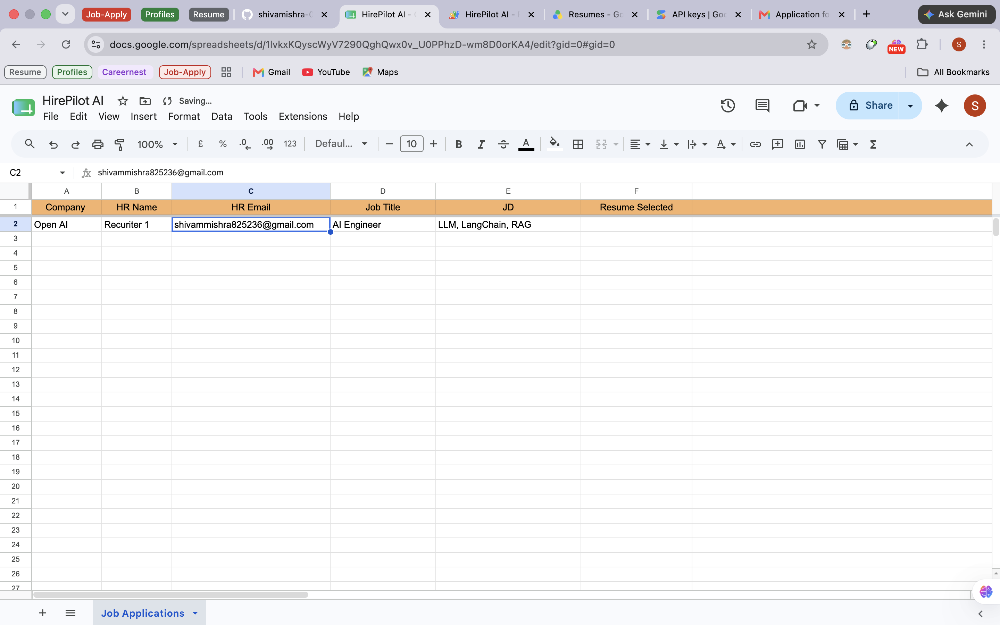
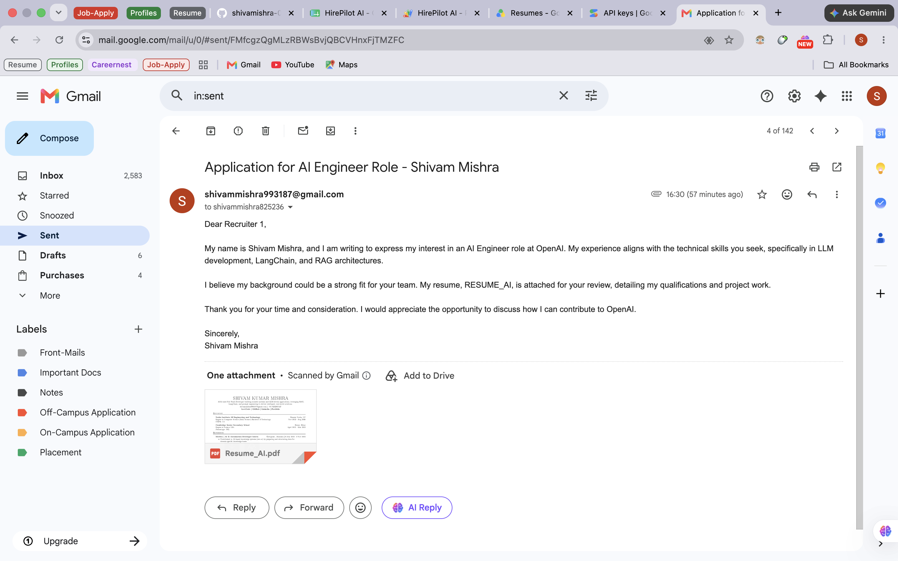
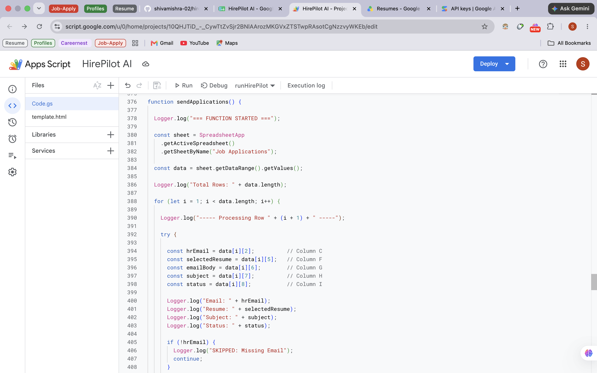
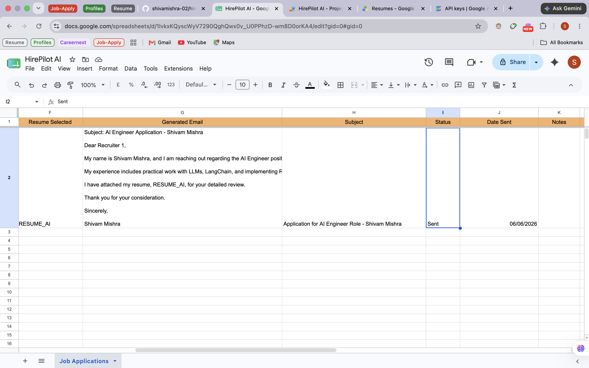

# 🚀 HirePilot AI

> **AI-powered job application automation** — analyze JDs, pick the right resume, write human-like cold emails, and send them — all on autopilot.

[](https://script.google.com)
[](https://ai.google.dev)
[](https://developers.google.com/gmail)
[](https://sheets.google.com)

---

## 📸 Screenshots

### 1️⃣ Google Sheet — Job Input


### 2️⃣ Gmail — Email Sent with Resume


### 3️⃣ Apps Script — Code Editor


### 4️⃣ Google Sheet — Status After Run


---

## 📌 What Is HirePilot AI?

HirePilot AI is a **Google Workspace automation system** that eliminates the pain of manually applying to jobs. You fill a Google Sheet with job details — HirePilot does everything else:

1. Reads the job description from your sheet
2. Sends it to **Gemini AI** for deep analysis
3. Picks the most relevant resume from your **Google Drive**
4. Writes a **personalized cold email** (not a template — an actually good one)
5. Sends it via **Gmail** with the right resume attached
6. Logs the status back into your sheet in real time

No browser extensions. No Zapier. No monthly SaaS fees. Just your Google account + Gemini API.

---

## 🏗️ Architecture

### High-Level System Flow

```
┌─────────────────────────────────────────────────────────────────┐
│                        HIREPILOT AI                             │
│                                                                 │
│  ┌──────────────┐    triggers     ┌────────────────────────┐   │
│  │ Google Sheet │ ──────────────▶ │   Apps Script (Code.gs)│   │
│  │  (Job Input) │                 │   — Main Orchestrator  │   │
│  └──────────────┘                 └───────────┬────────────┘   │
│                                               │                 │
│                          ┌────────────────────┼──────────────┐  │
│                          │                    │              │  │
│                          ▼                    ▼              ▼  │
│                 ┌────────────────┐  ┌──────────────┐  ┌──────┐ │
│                 │   Gemini API   │  │ Google Drive │  │Gmail │ │
│                 │  (JD Analysis) │  │   (Resumes)  │  │ API  │ │
│                 └───────┬────────┘  └──────┬───────┘  └──┬───┘ │
│                         │                  │             │     │
│                         ▼                  ▼             │     │
│                 ┌────────────────┐  ┌──────────────┐    │     │
│                 │Resume Selector │  │   Resume     │    │     │
│                 │  AI / Auto / Dev│◀─│   Fetcher    │    │     │
│                 └───────┬────────┘  └──────────────┘    │     │
│                         │                               │     │
│                         ▼                               │     │
│                 ┌────────────────┐                      │     │
│                 │ Email Generator│                      │     │
│                 │ AI + Fallback  │                      │     │
│                 └───────┬────────┘                      │     │
│                         │                               │     │
│                         └───────────────────────────────┘     │
│                                       │                        │
│                                       ▼                        │
│                              ┌────────────────┐                │
│                              │  Status Logger │                │
│                              │ (Back to Sheet)│                │
│                              └────────────────┘                │
└─────────────────────────────────────────────────────────────────┘
```

### Detailed Data Flow

```
[User fills Google Sheet row]
        │
        ▼
[Apps Script reads row data]
   - Company Name
   - HR Name & Email
   - Job Title
   - Job Description (JD)
        │
        ▼
[Gemini API — JD Analysis]
   Input: Raw JD text
   Output: Resume type + email draft
        │
   ┌────┴───────────────────┐
   │                        │
   ▼                        ▼
[AI Success]          [AI Failure]
   │                        │
   ▼                        ▼
[Gemini Email]      [HTML Fallback]
  (dynamic)          template.html
   │                        │
   └──────────┬─────────────┘
              │
              ▼
[Resume Selection Engine]
   RESUME_AI   → AI/ML/Data roles
   RESUME_AUTO → Automation roles
   RESUME_DEV  → Dev/Backend roles
              │
              ▼
[Gmail API — Send Email]
   + Attach correct resume (Drive blob)
   + Dynamic subject line
              │
              ▼
[Google Sheet — Status Update]
   Status: Sent / Failed
   Date: Timestamp
   Notes: Errors / fallback info
```

---

## ⚙️ Features

### 🧠 AI-Powered Core
| Feature | Details |
|---------|---------|
| JD Analysis | Gemini reads the full job description and extracts role context |
| Resume Matching | AI selects between 3 resume variants (AI / Automation / Dev) |
| Email Writing | Human-like cold emails — context-aware, no robotic phrases |
| Fallback Safety | If Gemini fails, HTML template kicks in automatically |

### 📧 Email Engine
| Feature | Details |
|---------|---------|
| Personalization | Uses HR name, company name, and JD context |
| Smart Subjects | Dynamically generated subject lines per application |
| Dual Mode | AI-generated OR HTML template fallback |
| Attachment | Correct resume attached automatically from Drive |

### 📊 Tracking System
| Column | What It Logs |
|--------|-------------|
| Status | `Sent` / `Failed` / `Pending` |
| Date Sent | ISO timestamp of delivery |
| Notes | Error message or fallback trigger reason |

---

## 🗂️ Project Structure

```
HirePilot-AI/
│
├── Code.gs               ← Main Apps Script logic (orchestrator)
├── template.html         ← Fallback HTML email template
├── README.md             ← This file
└── screenshots/          ← UI screenshots
    ├── sheet_input.png
    ├── email_sent.png
    ├── GAS_code.png
    └── sheet_update.png
```

### File Roles

**`Code.gs`** — The brain of the system. Contains:
- `main()` — entry point, reads sheet rows
- `analyzeJD(jd)` — calls Gemini API for JD analysis
- `selectResume(type)` — fetches correct file from Drive
- `generateEmail(data)` — builds the email body
- `sendEmail(to, subject, body, resume)` — Gmail send
- `updateSheet(row, status, notes)` — logs back to sheet

**`template.html`** — Fallback email template used when Gemini API fails or is rate-limited. Ensures 100% uptime of the automation.

---

## 🚀 Setup Guide

### Prerequisites

- Google Account (Gmail + Drive + Sheets)
- [Gemini API Key](https://aistudio.google.com/app/apikey) (free tier available)
- 3 resume files in Google Drive (PDF recommended)

---

### Step 1 — Copy the Google Sheet

Create a sheet with these exact column headers:

| A | B | C | D | E | F | G | H |
|---|---|---|---|---|---|---|---|
| Company Name | HR Name | HR Email | Job Title | Job Description | Status | Date Sent | Notes |

---

### Step 2 — Upload Resumes to Google Drive

Upload your 3 resume variants and copy their **File IDs** from the Drive URL:

```
https://drive.google.com/file/d/[THIS_IS_THE_FILE_ID]/view
```

---

### Step 3 — Configure `Code.gs`

Open **Extensions → Apps Script** in your Sheet, paste the code, and fill in the constants:

```javascript
const GEMINI_API_KEY = "your_gemini_api_key_here";

const RESUME_AI   = "drive_file_id_for_ai_resume";
const RESUME_AUTO = "drive_file_id_for_automation_resume";
const RESUME_DEV  = "drive_file_id_for_dev_resume";
```

---

### Step 4 — Set Up Trigger

In Apps Script:
1. Click **Triggers** (clock icon, left sidebar)
2. Click **+ Add Trigger**
3. Choose function: `main`
4. Event source: `From spreadsheet`
5. Event type: `On edit` (or set a time-based trigger for batch runs)

---

### Step 5 — Run It

Fill a row in your Google Sheet → the script fires automatically → check the Status column.

---

## ❓ Why Google Apps Script Can't Run Outside Google's Environment

This is one of the most common questions — and the answer is important to understand.

### The Core Reason: Apps Script IS Google's Infrastructure

Google Apps Script is **not a standalone programming language** — it's a **server-side JavaScript runtime that lives inside Google's ecosystem**. Think of it like this:

```
Normal JavaScript (Node.js):
  Your Code → Node Runtime → Your Machine → Internet

Apps Script:
  Your Code → Google's Runtime → Google's Servers → Google APIs
```

When you call `SpreadsheetApp.getActiveSheet()`, you're not calling a library — you're making an **internal Google service call** that only works within Google's authenticated environment.

### What Makes It Google-Only

| Capability | Why It's Bound to Google |
|-----------|--------------------------|
| `SpreadsheetApp` | Direct internal call to Google Sheets service — no public API equivalent |
| `GmailApp.sendEmail()` | Uses Google's internal mail infrastructure with your OAuth session baked in |
| `DriveApp.getFileById()` | Accesses Drive through Google's internal service mesh, not the REST API |
| `UrlFetchApp` | A Google-managed HTTP client with automatic OAuth token injection |
| Triggers | Run on Google's cron infrastructure — can't be replicated externally |

### The Authentication Reality

Apps Script handles OAuth **silently and automatically**. When you authorize a script once, Google stores your credentials server-side and injects them into every service call. There's no way to replicate this outside Google's environment without:

1. Setting up OAuth 2.0 yourself (separate `credentials.json`, token refresh logic)
2. Using the **Google REST APIs** instead of Apps Script's simplified wrappers
3. Running your own server (Node.js, Python, etc.) to host the logic

### If You Want to Run This Outside Google

You'd rewrite each Apps Script call to its REST API equivalent:

| Apps Script | External Equivalent |
|-------------|---------------------|
| `SpreadsheetApp.openById()` | Google Sheets REST API v4 |
| `GmailApp.sendEmail()` | Gmail REST API + nodemailer |
| `DriveApp.getFileById()` | Google Drive REST API v3 |
| Script Triggers | Cron job / GitHub Actions / Cloud Scheduler |

This is a significant rewrite — Apps Script's value is that it eliminates all of this complexity **when you're living inside Google Workspace**.

---


## 🔮 Future Roadmap

| Feature | Description | Priority |
|---------|-------------|----------|
| 📊 Resume Match Score | 0–100 similarity score between JD and resume | High |
| 🔗 LinkedIn Scraper | Auto-pull job details from LinkedIn URLs | High |
| 🔁 Auto Follow-ups | Send follow-up emails after 3–5 days of no reply | Medium |
| 🖥️ React Dashboard | Visual UI for managing applications | Medium |
| 📬 Email Analytics | Track open rates, reply rates, click-throughs | Medium |
| 🧪 A/B Testing | Test multiple email templates for conversion | Low |
| 🛡️ Rate Limiting | Daily send limits to avoid Gmail spam flags | High |
| 🌐 Multi-language | Email generation in other languages | Low |

---

## 🤝 Contributing

Contributions are welcome! Here's how:

1. **Fork** the repository
2. Create a feature branch: `git checkout -b feature/follow-up-emails`
3. Commit changes: `git commit -m "Add: automated follow-up system"`
4. Push: `git push origin feature/follow-up-emails`
5. Open a **Pull Request** with a clear description

---

## ⚠️ Limitations & Known Issues

- **Gmail daily send limit**: Google limits free accounts to ~500 emails/day. HirePilot doesn't yet enforce this internally (roadmap item).
- **Gemini rate limits**: Free tier Gemini API has RPM (requests per minute) limits. If you're processing many rows, add `Utilities.sleep(1000)` between rows.
- **Apps Script execution time**: Scripts timeout at 6 minutes per execution. For large batches, use a loop with time-check or process in smaller chunks.
- **Drive file permissions**: Resumes must be owned by or shared with the Google account running the script.

---

## 👨‍💻 Author

**Shivam Mishra**

Built to completely eliminate the repetitive grind of job applications using Google Workspace + Gemini AI.

> *"The best job application is the one you never had to manually write."*

---

## ⭐ Support

If HirePilot AI saved you hours of manual work:

- ⭐ **Star** the repo — it helps others find it
- 🍴 **Fork** it and build your own version
- 🐛 **Open an issue** if you hit a bug
- 💬 **Share** it with someone who's job hunting

---

<div align="center">

**Made with ❤️ and too many job applications**

</div>